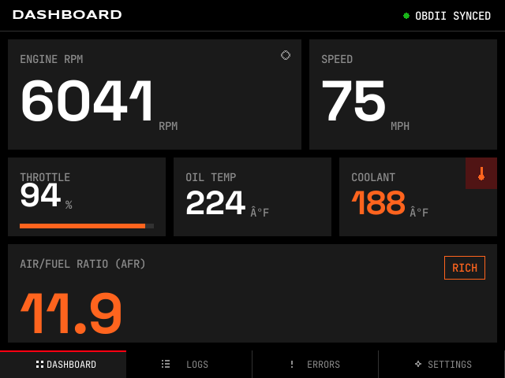
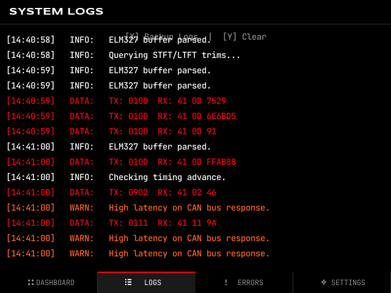
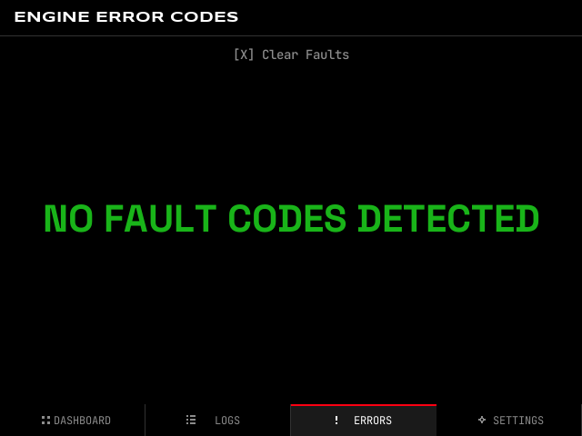
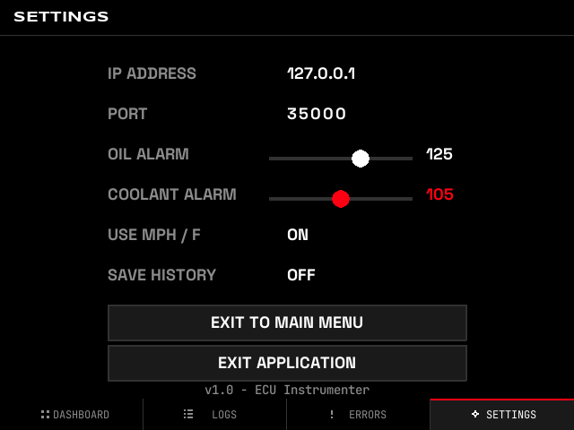
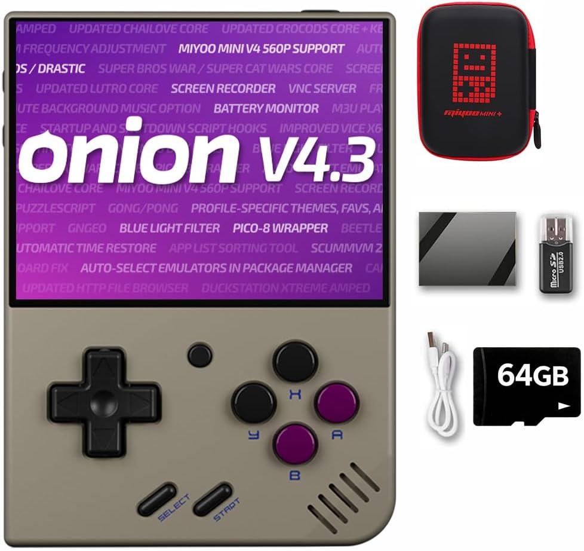
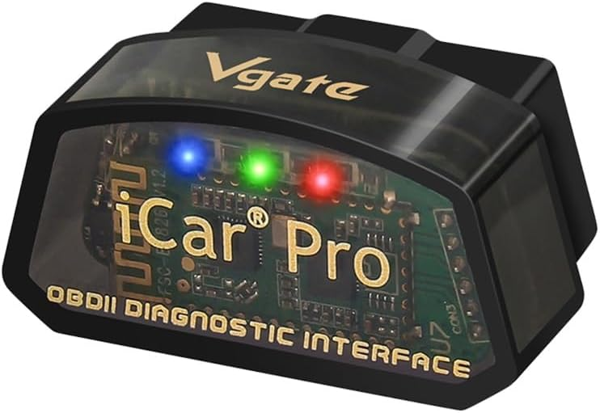

# ECU Instrumenter

ECU Instrumenter is a lightweight telemetry dashboard designed for the Miyoo Mini Plus running OnionOS. It connects to ELM327 Wi-Fi adapters over TCP to provide real-time vehicle data and diagnostics.

## Screenshots

| Dashboard | System Logs |
|:---:|:---:|
|  |  |
| **Fault Codes** | **Settings** |
|  |  |

---

## Features

- **OBD-II Connectivity**: Wireless polling of RPM, Speed, Throttle, Coolant, Oil Temp, and AFR via ELM327.
- **Simulator Mode**: Built-in engine simulation for testing without hardware connectivity.
- **Data Logging**: High-efficiency logging to `history.log` in JSON-Lines format.
- **Diagnostics**: Real-time DTC fault code reading and descriptions.
- **System Monitoring**: Integrated log viewer with export capability.
- **Compatibility**: Supports Miyoo Mini Plus (Python 2.7) and Desktop (Python 3.x).

## Control Scheme

### Tab Navigation

| Device | Previous Tab | Next Tab |
|:---|:---:|:---:|
| Miyoo Mini Plus | L Shoulder | R Shoulder |
| Desktop | Left Arrow | Right Arrow |

### Input Mapping

| Action | Miyoo Button | Desktop Key |
|:---|:---:|:---:|
| Confirm / Select | A | Space / Enter |
| Cancel / Back | B | Esc / Backspace |
| Clear Faults | X | Left Shift |
| Clear Logs | Y | Y |
| Navigation | D-Pad | Arrow Keys |

## Installation and Usage

### Running Locally (Development)
```bash
# Install dependencies
pip3 install pygame

# Optional: Run mock server in background
python3 mock_server.py &

# Start application
make run
```

### Deployment to Miyoo Mini Plus
The project includes a Makefile target for synchronizing files to the device over Wi-Fi/SSH.

```bash
# Deploy to default IP (192.168.1.53)
make deploy
```

## Architecture

The application is structured into three main layers:

- **App Layer (`app.py`)**: Manages the main loop, event dispatching, and screen transitions.
- **Core Layer (`core/`)**: Handles application state, OBD-II communication threads, and logging.
- **UI Layer (`ui/`)**: Contains screen-specific logic, reusable widgets, and drawing helpers.

Configuration for theme colors, display dimensions, and engine thresholds is centralized in `config/settings.py`.

## Adding Custom PIDs

New PIDs can be registered in `core/obd_client.py` within the `_setup_pid_map()` method:

```python
"01XX": {
    "attr": "attribute_name",
    "parser": lambda d: (int(d[0], 16) * scale_factor),
    "expected_len": 1
}
```

## License

This project is licensed under the MIT License.

```bash
# Verify code syntax
make check
```

---

### Hardware Reference
| | | |
|:---:|:---|:---:|
|  | [Miyoo Mini Plus](https://www.amazon.com/dp/B0GCD8XKJ2/) | Handheld |
|  | [Vgate iCar Pro](https://www.amazon.de/dp/B06ZZRNYVD/) | OBD-II Adapter |
